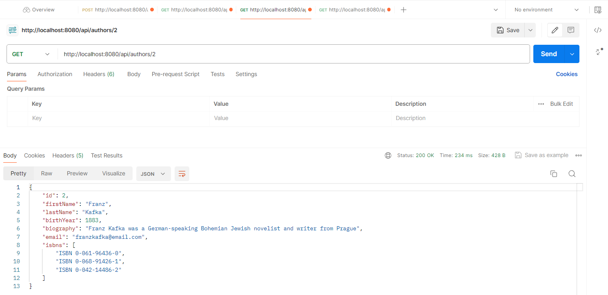
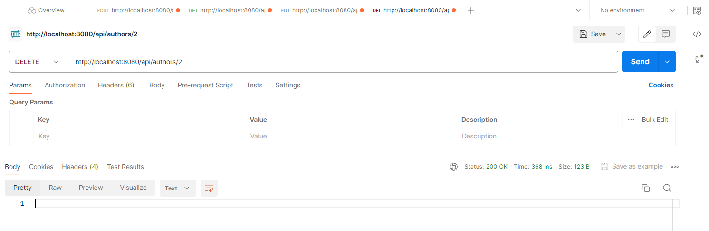

## Labs Repo for Cloud App Development
##### `Course:` Cloud App Development
##### `Master:` Software Engineering
##### `Institutions:` Polytechnic University of Tirana & Lufthansa Industry Solutions
---
### `Lab 1` - Creating a GitHub Repo 
     🟢 Created 'labs-cloud-app' repository
### `Lab 2` - Adding CRUD operations for an Author Entity
     🔴 Deleted .github, Dockerfile & Kubernetes folder
     🔴 Deleted Book's Postman CRUD ops images on 'img' folder
     🟢 Created Author, AuthorRepository & AuthorRestController class
     🔵 Modified Book, BookRepository & BookRestController class
     🟢 Created a 'secret.properties' config file to save database credentials
     🔵 Modified 'application.properties' file by removing database credentials
     🔵 Modified '.gitignore' file by adding 'secret.properties' 
     🟢 Added Author's Postman CRUD ops images on 'img' folder
     🔵 Modified app's README.md file with new images

---
## `Application:` Spring-Boot-Rest-API-PostgreSQL

#### `Plain REST API CRUD with Spring Boot and PostgreSQL.`

Technology stack:

    1️⃣ Spring Boot;
    2️⃣ Spring Web;
    3️⃣ Spring Data;
    4️⃣ PostgreSQL database;
    5️⃣ Hibernate;
    6️⃣ Spring Security (as basic authentication).
    7️⃣ Docker
    8️⃣ Log4j

##### To run this application use:

`mvn clean spring-boot:run`

The view in the Postman:

Add new Author

`POST /api/authors`

http://localhost:8080/api/authors

Get All Authors

`GET /api/authors`

http://localhost:8080/api/authors

Get Author By Id

`GET /api/authors/{id}`

http://localhost:8080/api/authors/{id}

Get Author By First Name

`GET /api/authors?firstName=firstName`

http://localhost:8080/api/authors?firstName=firstName

Edit Author

`PUT /api/authors/{id}`

http://localhost:8080/api/authors/{id}

Delete Author By Id

`DELETE /api/authors/{id}`

http://localhost:8080/api/authors/{id}

Delete All Authors

`DELETE /api/authors`

http://localhost:8080/api/authors

/////////////

kubectl config current-context -- To view your current context
kubectl config get-contexts -- To list all your contexts
kubectl config use-context my-context -- To switch to a different context:
