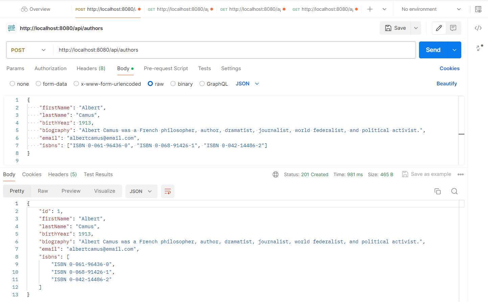
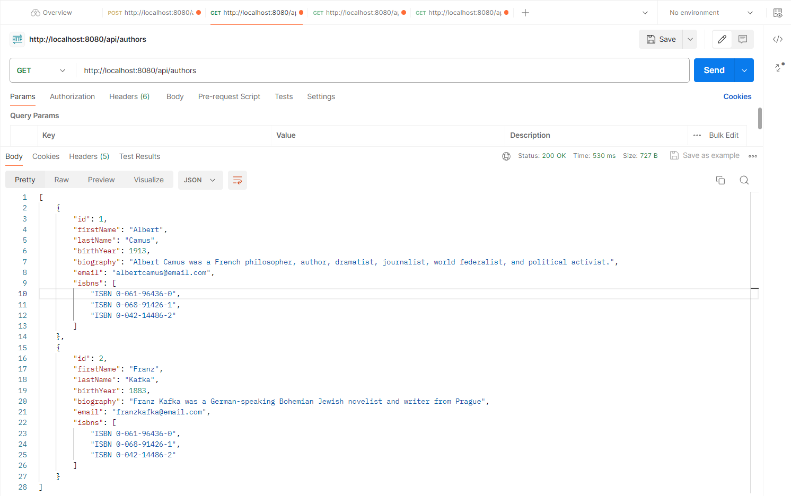
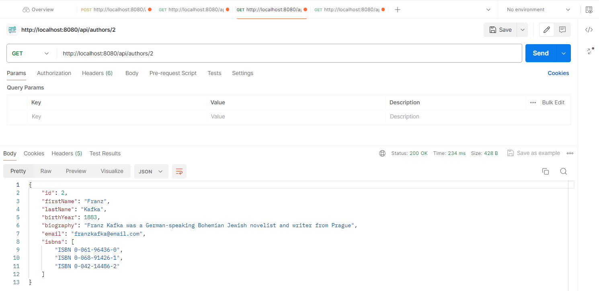
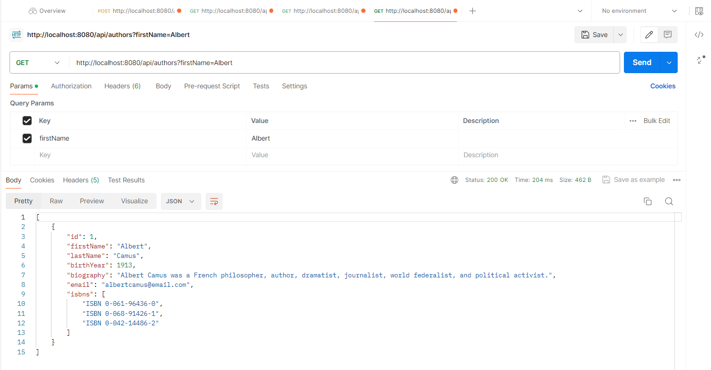
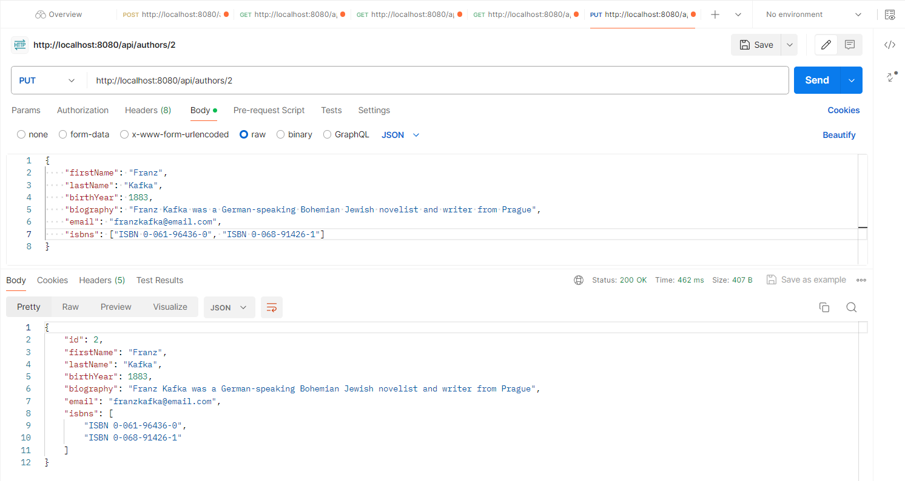
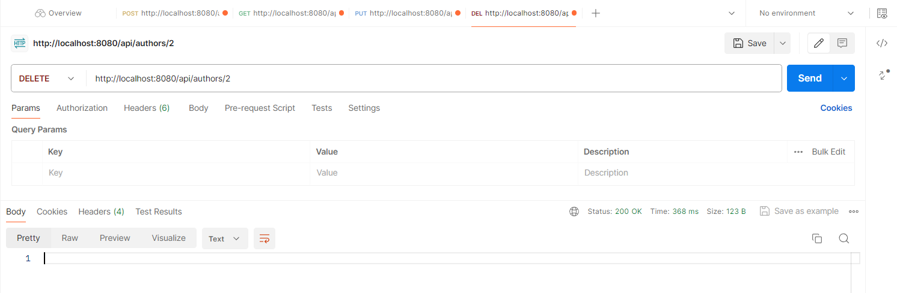
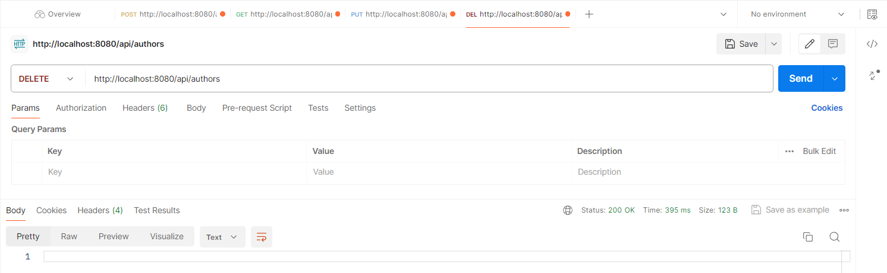

# spring-boot-rest-api-postgresql

#### Plain REST API CRUD with Spring Boot and PostgreSQL.

Technology stack:

* Spring Boot;
* Spring Web;
* Spring Data;
* PostgreSQL database;
* Hibernate;
* Spring Security (as basic authentication).

##### To run this application use:

`mvn clean spring-boot:run`

The view in the Postman:

Add new Author

`POST /api/authors`

http://localhost:8080/api/authors

Get All Authors

`GET /api/authors`

http://localhost:8080/api/authors

Get Author By Id

`GET /api/authors/{id}`

http://localhost:8080/api/authors/{id}

Get Author By First Name

`GET /api/authors?firstName=firstName`

http://localhost:8080/api/authors?firstName=firstName

Edit Author

`PUT /api/authors/{id}`

http://localhost:8080/api/authors/{id}

Delete Author By Id

`DELETE /api/authors/{id}`

http://localhost:8080/api/authors/{id}

Delete All Authors

`DELETE /api/authors`

http://localhost:8080/api/authors

/////////////

kubectl config current-context -- To view your current context
kubectl config get-contexts -- To list all your contexts
kubectl config use-context my-context -- To switch to a different context:
